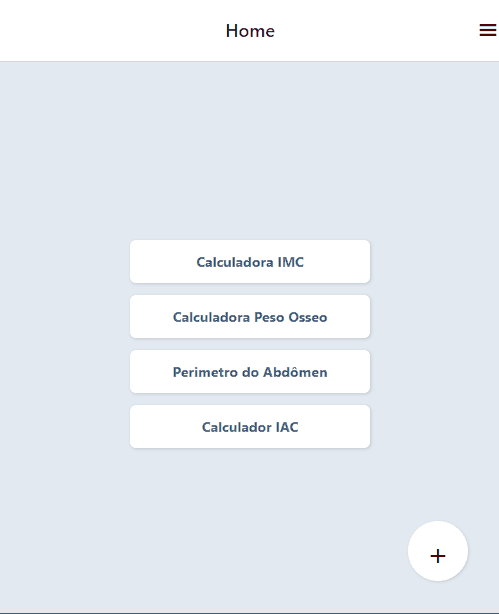

# WEB CHAT REAL TIME

## Sobre
Um web chat com comunicação em tempo real usando algumas tecnologias e frameworks.

## Imagens



#### Tecnologias

- [Expo](https://expo.dev/)
- [React Navigation](https://expo.dev/)
- [Tailwind React Native Classnames](https://github.com/jaredh159/tailwind-react-native-classnames)

### Como usar?

Para começar você irá precisar ter instalado na sua máquina algumas ferramentas:
[Git](https://git-scm.com), [NodeJS](https://nodejs.org/en/), também precisará de um emulador [Android Studio](https://developer.android.com/studio?hl=pt&gclid=CjwKCAjw1ICZBhAzEiwAFfvFhHLSUJj_5oi2_iujE7QitCc9tE3BjT5DXG-ML2YkUK8BMkz1PWBtWxoCU58QAvD_BwE&gclsrc=aw.ds) e algum editor de código como
[VSCode](https://code.visualstudio.com/)

#### Abra seu git bash e cole o código abaixo:

```bash
# Para clonar o repositório:
$ git clone git@github.com:Av3z/app-personal.git

# Entre na pasta do projeto:
$ cd app-personal

# Para instalar as dependencias digite:
$ npm install

# Para iniciar o projeto:
$ expo start

# Caso tenha algum problema de REDE tente usar

$ expo start --tunnel

# Depois que o servidor iniciar basta escanear o QR code, caso tenha android precisará baixar expo no seu celular
# Se for IOS apenas leia o QR code.